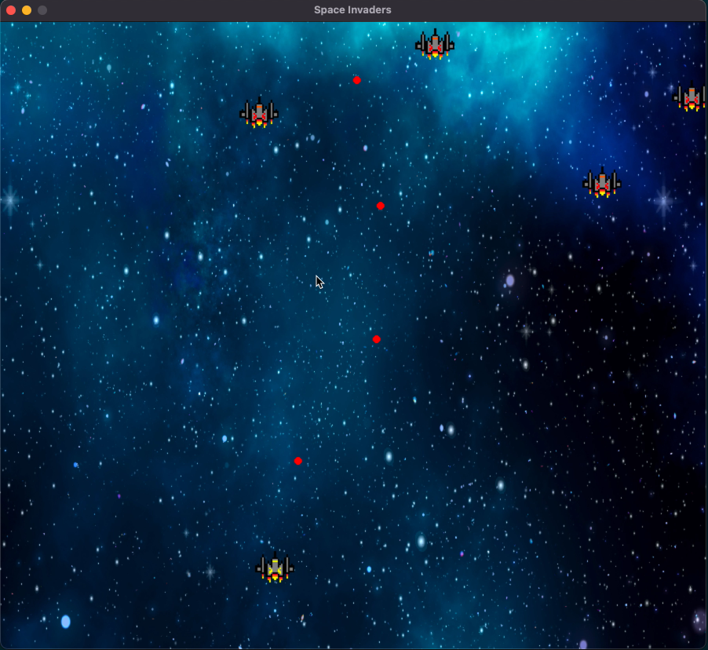

# Python Space Invaders?

This repository was created to test the [pygame](https://www.pygame.org/) library and create a minimal game to explore some basic game design concepts.

Exploring random topics seems pretty fun and allows me to get some knowledge in certain things that I never normally would work with. Heck, except for web development I have never made a UI. By using this library and just creating a MVP I learned about the basic game design elements, such as:

- How a game loop is constructed (cool topics, how would it work if it is not tied to FPS?)
- Event system and user input handling
- Drawing on a screen and related concepts, (what is SDL anyways?)
- How to pass audio and video from WSL to windows (kinda unrelated, but hey the rabbit hole and such...)

It also gives me some idea to later dive into engine design a bit. [This blog](https://www.gamedeveloper.com/programming/writing-a-game-engine-from-scratch---part-1-messaging) seems super cool, giving high level abstractions of game engine design. Maybe one day...

## Features

- Object Oriented Design
- Usage of Python's [protocol](https://www.python.org/dev/peps/pep-0544/)
- User input (move the ship and fire rockets)
- Object collision (kill enemy ships with rockets, or die by hitting them)
- Custom Events (using the event/message queue to send events which spawn enemies)

## If you actually wanna play this boring game

Its genuinly no fun, you can't win, you can only shoot some other ships, there's no score, there's nothing to be gained.

In fact, this image shows pretty much what the game entails:


If you really want to...

```sh
$ poetry install,
$ poetry run game
```
